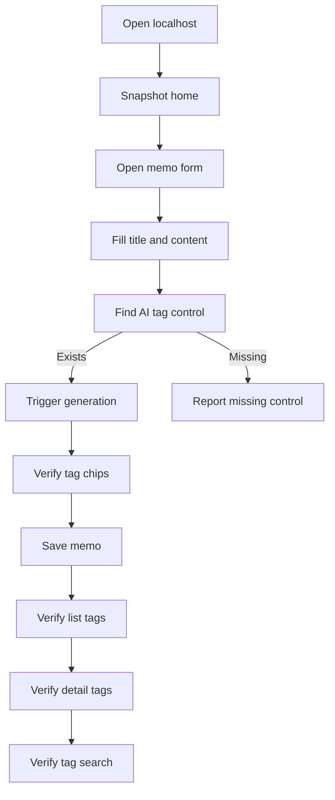

# AI 태그 브라우저 테스트 계획

## 대상과 전제

- 테스트 URL은 개발 서버 기본값인 `http://localhost:3000`으로 진행합니다. 서버 로그상 `/` 요청은 정상 응답 중입니다.
- 관련 화면은 `[src/app/page.tsx](src/app/page.tsx)`의 `새 메모` 버튼, `[src/components/MemoForm.tsx](src/components/MemoForm.tsx)`의 제목/내용/태그 입력 영역, `[src/components/MemoItem.tsx](src/components/MemoItem.tsx)` 및 `[src/components/MemoDetailModal.tsx](src/components/MemoDetailModal.tsx)`의 태그 표시 영역입니다.
- 현재 읽은 소스에서는 수동 태그 입력과 AI 요약 API(`/api/memos/summarize`)는 확인되지만, AI 태그 자동 생성 전용 UI/API는 검색되지 않았습니다. 브라우저에서 실제 UI가 보이는지 먼저 확인합니다.

## 브라우저 자동화 절차

1. `browser_tabs`로 기존 탭을 확인하고, 필요하면 `http://localhost:3000`으로 이동한 뒤 탭을 잠급니다.
2. `browser_snapshot`으로 홈 화면 구조를 확인하고 `새 메모` 버튼, 목록 카드, 검색 입력, 카테고리 필터가 정상 노출되는지 기록합니다.
3. 테스트 충돌을 줄이기 위해 고유 제목을 사용합니다. 예: `AI 태그 테스트 2026-04-28 15:49`.
4. `새 메모`를 열고 제목/내용을 입력합니다. 내용은 태그 추론이 쉬운 한국어 문장으로 구성합니다. 예: Next.js App Router, LocalStorage, Playwright E2E 테스트 계획을 포함한 메모.
5. 폼 내부에서 `AI 태그 생성`, `태그 자동 생성`, `추천 태그`, 이와 유사한 버튼/상태 문구를 스냅샷으로 찾습니다.
6. 진입점이 있으면 클릭하고 짧은 대기와 스냅샷 반복으로 로딩, 성공, 오류 상태를 관찰합니다.
7. 생성된 태그 칩이 태그 영역에 표시되는지 확인합니다. 최소 기준은 `비어 있지 않음`, `중복 없음`, `내용과 관련 있음`, `사용자가 저장하기 전에 확인 가능함`입니다.
8. `저장하기`를 클릭한 뒤 목록 카드에 새 메모와 `#태그`가 표시되는지 확인합니다.
9. 새 카드의 상세 모달을 열어 태그가 상세 화면에도 유지되는지 확인합니다.
10. 생성된 태그 중 하나를 검색 입력에 넣어 태그 기반 검색이 해당 메모를 찾아내는지 확인합니다.
11. 편집 버튼으로 메모를 다시 열어 태그가 폼에 복원되는지 확인하고, 필요하면 내용 변경 후 재생성 동작이 기존 태그를 어떻게 처리하는지 관찰합니다.
12. 마지막으로 브라우저 콘솔/화면 오류, API 실패 메시지, 무한 로딩 여부를 기록하고 탭 잠금을 해제합니다.

## 판정 기준

- 통과: AI 태그 생성 컨트롤이 노출되고, 클릭 후 관련 태그가 생성되어 저장, 목록, 상세, 검색, 편집 복원까지 일관되게 동작합니다.
- 실패: 컨트롤이 없거나, 생성 결과가 비어 있거나, 저장 후 사라지거나, 검색/상세/편집에서 일관성이 깨집니다.
- 차단: API 키/네트워크 오류처럼 환경 문제로 생성 자체가 불가능한 경우, UI 오류 메시지가 사용자에게 명확히 보이는지까지 확인하고 환경 차단으로 분리합니다.

## 참고 흐름

